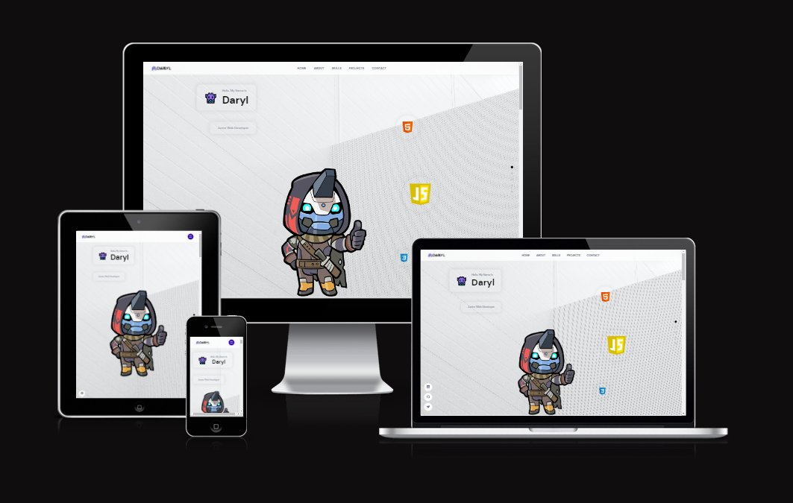
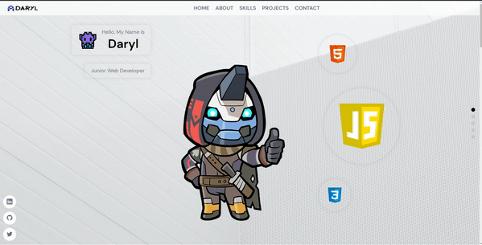
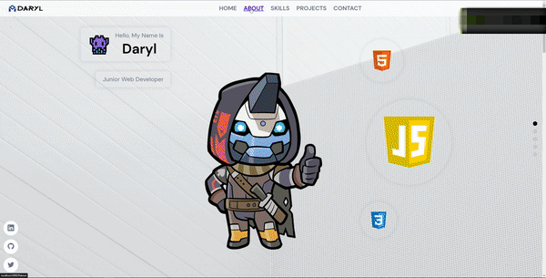
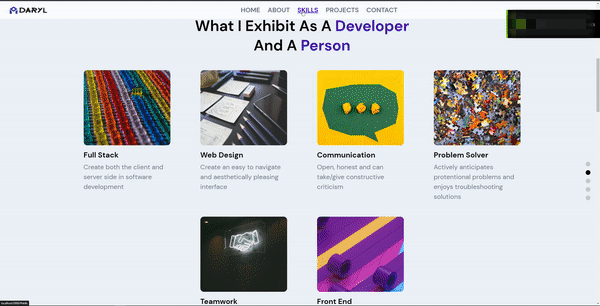
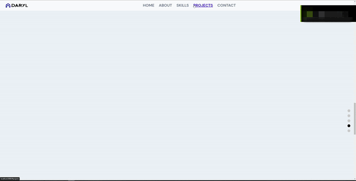
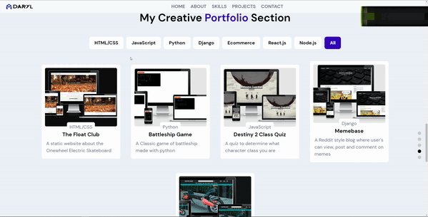
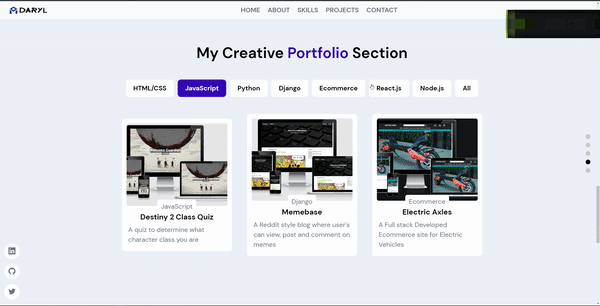
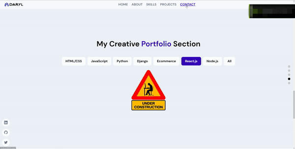

<h1 align="left">Portfolio Website</h1>



This project was created to be my online work portfolio, displaying my attributes, skills and completed projects as a junior web developer.
I used the JavaScript library called React to build this single page site along with the traditional front-end technologies such HTML, CSS and JavaScript.
Sanity was used to handle the backend and the full site is hosted on netify.

The live link can be found here: https://daryl-portfolio.netlify.app/

---

# Table of Contents:

- [Technologies Used](#technologies-used)
- [React with Sanity](#react-with-sanity)
- [Features](#features)
  - [Existing Features](#existing-features)
  - [Features left to implement](#features-left-to-implement)
- [Bugs](#bugs)
- [Deployment](#deployment)
- [Credits](#credits)
- [Acknowlegments](#credits)

---

# Technologies Used

- ## Programming Languages, Libraries and Editors

  - [HTML5](https://en.wikipedia.org/wiki/HTML5)
  - [CSS3](https://en.wikipedia.org/wiki/CSS)
  - [JavaScript](https://en.wikipedia.org/wiki/JavaScript)
  - [SASS](https://sass-lang.com/)
  - [React](https://reactjs.org/)
  - [Visual Studio Code](https://code.visualstudio.com/)
  - [Git](https://git-scm.com/)
  - [Github](https://github.com/)

- ### Tools Used:

  - [Sanity](https://www.sanity.io/)
  - [Google Fonts](https://fonts.google.com/)
  - [Framer Motion](https://www.framer.com/motion/)
  - [React Icons](https://react-icons.github.io/react-icons/)

[Back to Top](#table-of-contents)

---

## React with Sanity

- Sanity was used to create the backend for this project.
- Node and `npm` is needed to install the sanity package, using `npm create sanity@latest -- --coupon javascriptmastery2022` gives you double free monthly usage of 200k API requests, 1M API CDN requests and 20GB Bandwith.
- Then login with either Google, Github or an e-mail.
- Give the project a name and use the default dataset configuration.
- Add a project output path which can be a folder in your workspace and select a project with no predefined schemas.
- `npm run dev` in the console will take you to your sanity desk where all your data will be stored.
- The next step is to define your schemas that you want your site to have. In the schema folder add your file.js and the file structure you expect to export e.g:

```
name:'filename',
title:'filetitle',
type: 'document',
fields:[
    {
        name:'name',
        title:'Name',
        type: 'string'
    }
```

- Then in the index.js in the schemas folder import the file `import filename from './filename` and use `export const schemaTypes = [file]` to use the schema.
- Running `npm run dev` again will show the schema in the sanity desk and you can add your data from there using the fields specified.

- The JavaScript React library was used to create the frontend for this project.
- `npm create-react-app my-app` installs the basic file structure for the project.
- `npm install @sanity/client @sanity/image-url framer-motion node-sass react-icons` are all the dependecies used for this project.
- Connecting sanity to react requires a client file in the frontend source folder with:

  ```
   import sanityClient from "@sanity/client"

   export const client = sanityClient({
   projectId: process.env.REACT_APP_SANITY_PROJECT_ID,
   dataset: "production",
   apiVersion: "date",
   useCdn: true,
   token: process.env.REACT_APP_SANITY_TOKEN,
   ignoreBrowserTokenWarning: true,
   })

  ```

- The `REACT_APP_SANITY_PROJECT_ID` and `REACT_APP_SANITY_TOKEN` being secret variables that should be in the .env file.

## [Back to Top](#table-of-contents)

# Features

## Existing Features

- Home

  - First view of the site the visitor is shown 3 moving elements, a name banner, profile image and three circles.
  - The elements are animated using framer motion and varry slightly using different animations and load times.
  - The name banner has a greeting to the page with my name and my job title.
  - The profile image is png of my favourite video game character to be later replaced.
  - The three circles have contained in them the three languages used for front end development varring in sizes.



<br/>

- About

- This section highlights my attributes as a developer and a person.
- Uses framer motion to highlight each attibute as the mouse scrolls over.



<br/>

- Skills and Expereinces

- This section has the languages, frameworks, libraries and databases that I have used.
- Framer motion is used to highlight each skill as they are scrolled over.
- It also has my work experience and the tasks I would undergo in them.



<br/>

- Projects

- This section holds the links to both the codebase and live site to my portfolio projects.
- Framer motion is used to let the visitor hover over a selected project and has choices to open each link on a new page.
- 

- Each project has tags and can be filtered by clicking on one of the choices above.
- The most prevelent tag for each project is seen bellow the project image.
- 

- If a chosen filter has no project with that tag another image is shown.
- This lets the visitor know that I have more projects in the works.
- 

<br/>

- Contact Me

- This section is a way for the visitor to get in touch with me by having my contact details.
- My email and phone number are clickable links that redirect accordingly.
- There's also a form element that the visitor can leave their details and this data is sent to the sanity backend which I can view.



<br/>

- Higher Order Component wrappers

- HOC were used for the social media icons, the navigational dots and the overall div using framer motion.
- The idea for having a HOC is to reuse component logic and keeps the individual pages where its used more lean.
- The wrappers are used by adding them to a page's export default expression.
- The AppWrap.js holds the NavigationDots and SocialMedia components which can be seen on all sections.
- The navigations got seen on the right of each section lets you know what section you're on and can click on the dots to move to the corresponding section.
-  
- The MotionWrap.js uses framer motion that replays all the animations in each sections when scrolled to or when clicked on.

<br/>

[Back to Top](#table-of-contents)

## Features left to Implement

- Possible features to add in future updates:

- Have the form data be sent to my personal email using emailJs.
- Get data from co-workers to fill out the testimonial section which is currently not being implemented.

[Back to Top](#table-of-contents)

---

# Bugs

-

## Bugs Solved

---

# Deployment

## Visual Studio Code

- This project was created locally using Visual Studio Code and used git to connect the local files to the github repository on my account.
- When commiting any file changes both the local and online codebase was updated.
- A quick setup to acheive this:
  - Create a repositry on github and a new folder in your local Visual Studio Code
  - In your local workspace terminal type `git init`
  - Then `git add .` and `git commit -m "first commit"`
  - Then `git branch -M main`
  - Then `git remote add origin https://github.com/username/reponame.git`
  - Finally `git push -u origin main`

## Github and Gitpod

- Forking the GitHub Repository

  - If you want to make changes to your repository without affecting it, you can make a copy of it by 'Forking' it. This ensures your original repository remains unchanged.

  - Find the relevant GitHub repository
  - In the top right corner of the page, click the Fork button (under your account)
  - Your repository has now been 'Forked' and you have a copy to work on
  - Cloning the GitHub Repository

- Cloning your repository will allow you to download a local version of the repository to be worked on. Cloning can also be a great way to backup your work.

  - Find the relevant GitHub repository
  - Press the arrow on the Code button
  - Copy the link that is shown in the drop-down
  - Now open Gitpod & select the directory location where you would like the clone created
  - In the terminal type 'git clone & then paste the link you copied in GitHub
  - Press enter and your local clone will be created.

## Deployment to Netlify

- `npm run build` command creates a full build of your application which then can be used to upload to netlify.
- Uploading the build folder to netlify requires you to simply drag the build folder into the sites section.
- It then gives you the option to edit your domain name.
- It then takes you to the site's dashboard with the link to the live site.

[Back to Top](#table-of-contents)

# Credits

- [JavaScript Mastery](https://www.youtube.com/watch?v=3HNyXCPDQ7Q) for the tutorial for creating and deploying this site.

## Media

- [Unsplash](https://unsplash.com/) for homepage image.
- [Ezgif](https://ezgif.com/maker) to create the gifs.

# Acknowledgements

[Back to Top](#table-of-contents)
